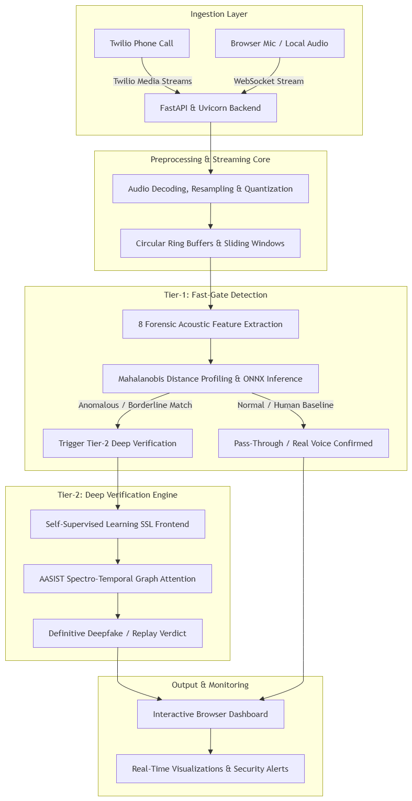

# VaniShield AI

Voice anti-spoofing and deepfake detection for live telephone audio.

> Project status: experimental / under active development.

<!-- Replace this placeholder with the project logo once added. -->


## Demo Preview

### Screenshots

Add screenshots of the dashboard and detection results here:

```text
docs/assets/dashboard-screenshot.jpeg
docs/assets/detection-result-screenshot.jpeg
```


### Video Demo

```text
docs/assets/Vanishield-AI.mp4
```

## Project Overview: VaniShield AI

VaniShield AI is an enterprise-grade, real-time voice anti-spoofing and deepfake audio detection system engineered to protect live communication channels—such as voice calls, VoIP streams, and contact centers—from sophisticated synthetic speech and replay attacks.   

By combining high-speed statistical heuristics with deep learning, VaniShield delivers robust security with minimal latency, ensuring legitimate human conversations flow uninterrupted while malicious or cloned audio is instantly intercepted.

Key Architectural Components:

Dual-Tier Detection Pipeline: Features a lightning-fast Tier-1 statistical fast-gate backed by an optional deep-learning Tier-2 (SSL-AASIST) engine for high-precision verification.   
PPTX

Tier-1 Feature-Based Analysis: Utilizes a Mahalanobis-distance detector evaluating forensic acoustic markers (including pitch jitter, shimmer, spectral flux, glottal spectral slope, and room impulse responses) to flag phase and acoustic anomalies.   
PPTX

Tier-2 Engine: SSL-AASIST Deep Verification
Core Architecture: Combines a powerful self-supervised pre-trained frontend (such as Wav2Vec 2.0 / XLS-R or WavLM) with an AASIST (Audio Anti-Spoofing using Integrated Spectro-Temporal graph Attention) backend.

Role in the Pipeline: It acts as the secondary validation tier. If Tier-1's fast-gate encounters ambiguous audio streams, borderline confidence scores, or complex synthetic artifacts, the stream is routed to Tier-2 for definitive neural analysis.

Real-Time Streaming Inference: Powered by ONNX runtime for ultra-low latency streaming inference, leveraging circular ring buffers, sliding windows, audio resampling, and quantization.

Backend & Integration: Built on a high-performance FastAPI and Uvicorn backend supporting real-time WebSocket audio streaming and Twilio Media Streams audio decoding.   

Training & Monitoring Pipeline: Features a robust PyTorch training pipeline trained on diverse speech datasets (such as ASVspoof and In-the-Wild), paired with an interactive browser-based dashboard for live call monitoring and real-time feature trend analysis.  

### Detailed Architecture



## Repository Layout

```text
client/                  Browser dashboard
server/                  Main FastAPI backend and Tier-1 pipeline
ssl_aasist_project/      Optional Tier-2 SSL-AASIST model
sih-voice-detector/      Twilio streaming pipeline components
models/                  Local model artifacts; do not commit
local_cache/             Local training outputs and manifests; do not commit
fairseq/                 Local fairseq dependency; ignored from Git
train.py                 Training entry point
export_onnx.py           PyTorch-to-ONNX export script
test_client.py           Batch streaming/evaluation test
test_tier1.py            Tier-1 detector tests
```

## Requirements

- Python: 3.14.6
- PyTorch and TorchAudio
- FastAPI and Uvicorn
- NumPy, SciPy, scikit-learn, librosa
- ONNX Runtime: 
- Optional: CUDA-capable GPU
- Optional: Twilio account and Media Streams configuration

Install dependencies:

```bash
python -m venv .venv
# Windows
.venv\Scripts\activate
# macOS/Linux
source .venv/bin/activate
pip install -r requirements.txt
```

## Models

Place required model files in the local model directory:

- `models/master_tier1.pth`
- `models/SSL_best.pt` (optional Tier-2 model)
- `models/streaming_model_int8.onnx`


## Dataset Preparation

The training script expects real and spoof audio data organized by domain.

```text
<data-root>/
  real/
    asvspoof/
    in_the_wild/
    librispeech/
  spoof/
    asvspoof/
    in_the_wild/
    librispeech/
```

Before training, document:

- Dataset download instructions.
- Dataset licenses and attribution.
- Audio format and sample-rate requirements.
- Any preprocessing or speaker/group split rules.
- How private or sensitive recordings are handled.

## Training

```bash
python train.py --help
python train.py `<add required arguments>`
```

Training outputs should be written to a local cache or private artifact store. Do not commit audio data, run manifests containing local paths, checkpoints, or evaluation recordings.

## Exporting the ONNX Model

After training or obtaining the PyTorch weights:

```bash
python export_onnx.py
```

The export currently uses a 16 kHz, 1-channel input window of 1,600 samples. Confirm the generated ONNX model and runtime quantization procedure before production deployment.

## Running the Backend

Main backend:

```bash
uvicorn server.main:app --host 0.0.0.0 --port 8000
```

Open the dashboard at:

```text
http://localhost:8000/
```

Required deployment configuration:

- Public HTTPS/WSS endpoint for Twilio.
- Twilio Media Streams webhook configuration.
- Authentication and authorization for WebSocket connections.
- Environment variables for thresholds and feature flags.
- Logging and retention policy for call audio and detection results.

## Configuration

Use a local `.env` file or deployment secret manager. Never commit credentials, API keys, Twilio tokens, private keys, call recordings, or customer data.

## Testing

```bash
python -m pytest
python test_tier1.py
python test_client.py
```

Add or document tests for:

- Audio decoding and resampling.
- Streaming buffer boundaries.
- Model input/output shapes.
- Real/spoof threshold behavior.
- WebSocket connection and disconnect handling.
- Twilio event payloads.

## Security and Privacy

This project processes voice data, which may be biometric or personally identifiable information. Before deployment:

- Remove secrets from source code and Git history.
- Avoid storing raw call audio unless strictly necessary.
- Define retention, deletion, consent, and access policies.
- Protect WebSocket endpoints from unauthorized access.
- Validate uploaded and streamed data sizes and formats.
- Treat untrusted model files such as pickle files as unsafe to load.

## Contributors

Add project contributors and their roles here:

| Name | Role | 
| --- | --- | --- |
| `AMIT KUMAR SINGH` | Project lead | 
| `ANOOP KUMAR` | Tier 2 Engine and Testing |
| `ANKIT KUMAR` | Backend / infrastructure |
| `ANSHUL GUPTA` | Tier 1 Engine |
| `VASUNDHRA RAJPUT` | Ingestion Model |
| `HIMANSHU SINGH` | Frontend / dashboard |

## Thank You

Thank you to the contributors, reviewers, dataset creators, open-source maintainers,
and research communities whose work supports this project. Special thanks to the
teams behind fairseq, SSL-AASIST, PyTorch, FastAPI, ONNX Runtime, and the audio
datasets used for evaluation.

## License

`<add project license>`

Third-party components, including fairseq and model checkpoints, may have separate licenses. Review and preserve their license and attribution files before redistribution.

## References

Add the papers, repositories, datasets, and standards used by the project:

1. `<Voice anti-spoofing or deepfake detection paper>` - https://doi.org/10.48550/arxiv.2510.24852/
2. `<SSL-AASIST paper or repository>` 
3. `<fairseq repository>` - https://github.com/facebookresearch/fairseq
4. `<PyTorch documentation>` - https://pytorch.org/docs/
5. `<ONNX Runtime documentation>` - https://onnxruntime.ai/docs/
6. `<ASVspoof dataset reference>` 
7. `<In-the-wild dataset reference>` 
8. `<LibriSpeech dataset reference>` 
9. `‌<Web Audio API: Advanced Sound for Games and Interactive Apps>` - https://webaudioapi.com/